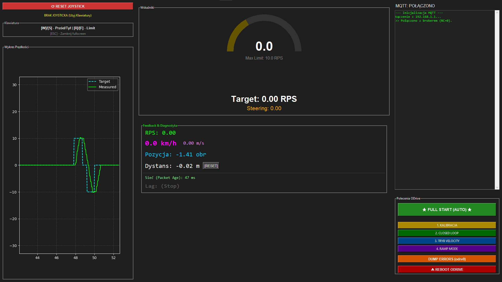

# Orion VI Propulsion - Control Station Application

**A Python-based telemetry dashboard and remote control interface for the Orion VI Mars Rover propulsion system.**

This application connects to the rover's onboard network via MQTT, allowing the operator to send drive commands using a joystick or keyboard, monitor real-time feedback from motor controllers (ODrive), and visualize performance data.


*Screenshot of the control application interface showing real-time velocity graph, telemetry stats, and control buttons.*

## 🧠 How It Works (Architecture Overview)

The application is built on a multi-threaded architecture designed to separate user interface rendering from high-frequency data processing and network communication.

The core functionality relies on four main components interacting through a shared, thread-safe state object:

### 1. The Shared State (`AppState`)
At the center of the application is the `AppState` object. It acts as the "single source of truth," holding all current data, including:
* **Target values:** Desired speed and steering requested by the operator.
* **Telemetry data:** Measured speed, distance traveled, and connection status received from the rover.
* **System flags:** Status of network lag and ODrive states.

All other modules read from or write to this shared object using thread locks to ensure data integrity.

### 2. Input Processing (`InputManager`)
Running in the main loop, this module continuously polls connected hardware:
* It uses the `pygame` library to read axis positions and button presses from connected **Joysticks or Gamepads**.
* It acts as a fallback, reading **Keyboard** presses (W/S for throttle).
These inputs are translated into normalized control values (e.g., throttle between -1.0 and 1.0) and immediately updated in the `AppState`.

### 3. Communication Bridge (`Communicator`)
This runs in a dedicated background thread to handle network traffic without freezing the GUI:
* **Publishing (TX):** It periodically reads the target control values from `AppState`, formats them into JSON packets, and publishes them to the MQTT broker (topic: `rover/control`).
* **Subscribing (RX):** It listens to telemetry topics (e.g., `rover/telemetry/propulsion`). Incoming JSON data from the rover's hardware is parsed and used to update the measured values in `AppState`. It also calculates network latency.

### 4. GUI Rendering (`GUI`)
The main application thread uses **Tkinter** for the interface and **Matplotlib** for graphing.
* It does not process data itself. Instead, uses a timer callback (e.g., every 50ms) to fetch the latest snapshot of data from `AppState`.
* It then updates the text labels, refreshes the velocity-over-time graph, and prints messages to the on-screen console.

---

## 🛠️ Installation & Setup

1.  **Requirements:** Python 3.10+ and network connectivity to the rover's MQTT broker.
2.  **Install dependencies:**
    ```bash
    pip install -r requirements.txt
    ```
    *(If requirements.txt is missing: `pip install paho-mqtt pygame matplotlib`)*

3.  **Configuration:**
    Open `config.py` and ensure the MQTT broker IP matches your rover's network setup:
    ```python
    # config.py
    MQTT_BROKER_IP = "192.168.1.XXX" # Replace with actual IP
    ```

4.  **Run the application:**
    ```bash
    python main.py
    ```

## 🎮 Controls

The application prioritizes a connected Joystick/Gamepad over keyboard input.

| Input Method | Action | Description |
| :--- | :--- | :--- |
| **Joystick Axis 1** | Throttle | Forward / Reverse speed control. |
| **Joystick Axis 2/5**| Steering | Differential steering control. |
| **Keyboard 'W'** | Forward | Full throttle forward. |
| **Keyboard 'S'** | Reverse | Full throttle reverse. |

---
**Developed by KN Microchip (Politechnika Lubelska)**
